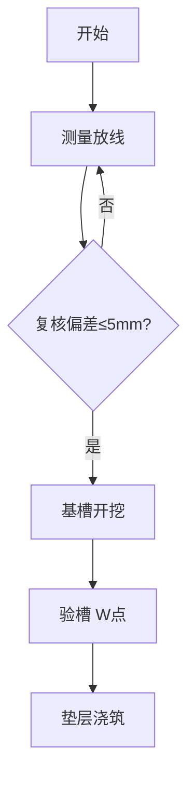

# 标书施工图表生成技能

## 产物呈现（强制）

本技能任何产出交付文件（docx/xlsx/pptx/pdf/png 等）的任务：

1. 文件落盘成功后立即登记：
   `python ~/.qidi/skills/office-artifact/scripts/card.py add <产物路径> --skill bid-diagram --note <一句话说明>`
2. 任务最终回复前必须输出卡片总览：
   `python ~/.qidi/skills/office-artifact/scripts/card.py show`
3. 不许只回一行文件路径就结束；卡片失败则降级为 Markdown 表格列出全部产物。


四类程序化图表（脚本生成 PNG）+ 两类规范图（平面图/流程图）。
所有图表输出 150dpi PNG，中文字体自动适配（SimSun/微软雅黑）。

## 一、横道图（甘特图）— scripts/gen_gantt.py

```bash
python scripts/gen_gantt.py tasks.json -o 横道图.png --title "施工进度计划"
```

tasks.json 格式（start_day/duration 单位为开工后第 N 天）：

```json
[
  {"name": "施工准备", "start_day": 1, "duration": 10, "category": "土方工程",
   "is_critical": true, "predecessor": null},
  {"name": "场地平整", "start_day": 11, "duration": 15, "category": "土方工程",
   "is_critical": true, "predecessor": "施工准备"}
]
```

规范要点：
- 分部工程配色（土方红/基础青/主体蓝/装饰绿/机电黄/室外紫/验收浅蓝）
- 关键线路红色加粗，非关键蓝色
- 工序间逻辑关系箭头（predecessor 字段）
- 数据须与工期闭合链一致（工程量÷日工效=duration）

## 二、双代号网络图 — scripts/gen_network.py

```bash
python scripts/gen_network.py activities.json -o 网络图.png
```

activities.json 格式：

```json
[
  {"id": "A", "name": "施工准备", "duration": 10, "predecessors": []},
  {"id": "B", "name": "场地平整", "duration": 15, "predecessors": ["A"]},
  {"id": "C", "name": "基础施工", "duration": 30, "predecessors": ["B"]}
]
```

规范要点：
- 节点圆圈编号，箭线标注"工序名(duration)"
- **关键线路双线/红色加粗**标注总工期
- 虚工序（逻辑约束）用虚箭线
- 自动计算最早/最迟开始时间，标注总时差

## 三、进度 S 曲线 — scripts/gen_scurve.py

```bash
python scripts/gen_scurve.py schedule.json -o S曲线.png
```

schedule.json 格式：

```json
{
  "project_name": "XX项目",
  "total_duration": 300,
  "monthly_planned": [5, 12, 20, 25, 20, 10, 8],
  "monthly_actual": [4, 13, 19]
}
```

- 蓝色计划曲线 + 红色实际曲线对比，标注当前进度偏差
- 累计百分比 Y 轴，月度 X 轴

## 四、劳动力动态直方图 — scripts/gen_labor.py

```bash
python scripts/gen_labor.py labor.json -o 劳动力直方图.png
```

labor.json 格式（各阶段各工种人数，峰值须与劳动力闭合链一致）：

```json
{
  "project_name": "XX项目",
  "phases": ["施工准备", "基础", "主体", "装饰", "竣工"],
  "workers": {
    "普工": [10, 20, 30, 20, 10],
    "钢筋工": [0, 15, 25, 5, 0],
    "木工": [0, 12, 20, 8, 0]
  }
}
```

- 堆叠柱状图（分工种配色）+ 总人数折线
- 附平均人数/峰值人数/总工日统计

## 五、施工平面布置图（绘图规范，代码或 AI 绘制）

按以下规范绘制（matplotlib 手绘 或 mermaid/绘图工具 或 `/bid-render` 生成）：

1. **要素清单**：围墙/大门（2个以上）、临时道路（环形≥6m宽）、办公生活区、
   材料堆场（钢筋/模板/水泥库）、加工棚（钢筋/木工）、塔吊覆盖圆、
   临时用电（变压器+三级配电）、临时用水（水源+管网）、消防设施、洗车池、
   排水沟
2. **图例**：右上角，常规符号（已有建筑实线/临建虚线/道路双线/水电点划线）
3. **标注**：各区域尺寸（如"钢筋堆场 20m×15m"）、指北针、比例尺
4. **分期**：主体阶段/装饰阶段分开两图（场地需求不同）
5. 塔吊覆盖半径须与设备闭合链台数对应

## 六、工艺流程图（规范）

1. 泳道式（按责任单位分道）或线性流程（开始→工序→质检→结束）
2. 菱形=判断节点，矩形=工序，平行四边形=材料进场
3. 质量控制点（停止点 W、见证点 H）用三角标注
4. 每工序标责任人岗位（班组长/质检员/监理）
5. 用 mermaid `flowchart TD` 语法起草，代理转 PNG 或直接贴 mermaid 源码到 Word



## 通用要求（所有图表）

- 图号图题齐全：`图4-1 XX项目施工进度计划横道图`，且**被正文引用**（"见图4-1"）
- 每图配 50~100 字读图分析（不能裸贴）
- 与四大闭合链数据同源（同一 JSON 数据文件派生横道图+网络图+S曲线，保证一致）
- 插入 Word 后缩放一致（宽度统一 15cm 左右）
